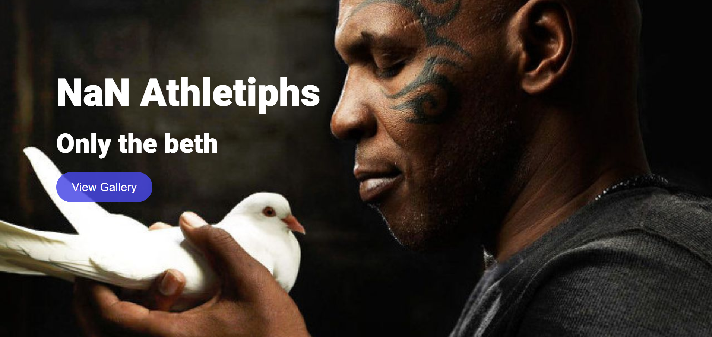
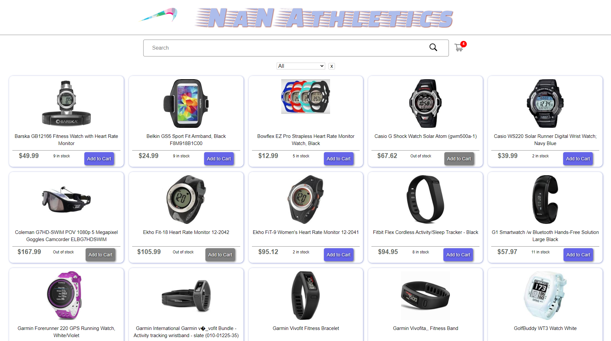
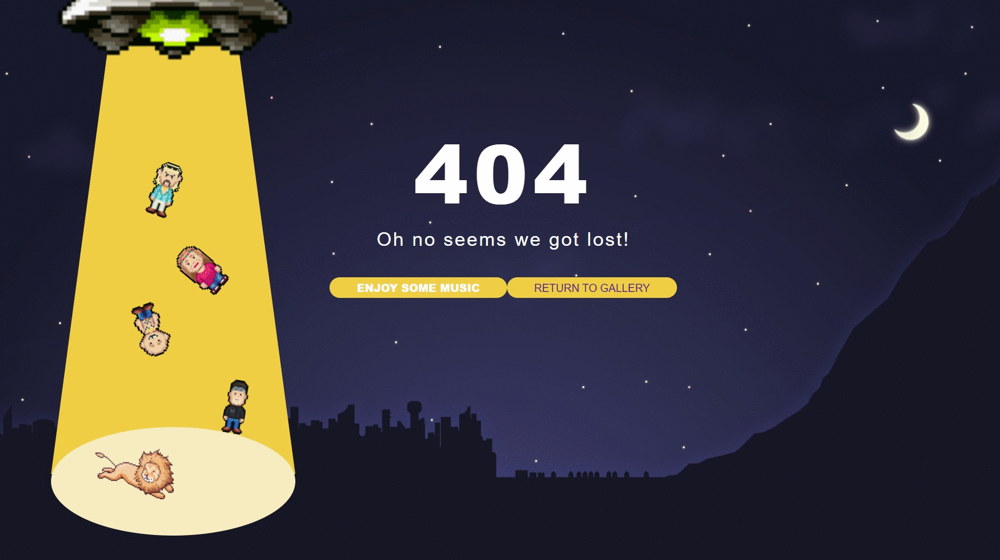

This repo is a team project for Concordia Fullstack Bootcamp 2020. The goal was to build an E-Commerce website according to given specs.
We used :
- React 
- Redux 
- Node.js.

In order to spice things up, we came up with a name for our fake brand, NaN Athletics. We gave ourselves a brand ambassador, Mike Tyson and a mascot, Super Fox. We also added a household favorite, Tiger King, to our collection of inspiring stuff we wanted to use for the website. Because, you know, the more, the merrier.

Super Fox, our super spinner is visible throughout the demo gif (see below). We added a setTimeout() to the backend to simulate response delay so we could enjoy the presence of our little friend a bit longer.

So.. without further ado

# Landing page

# The gallery

# 404 page

